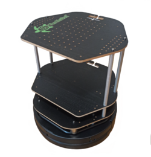

# TurtleBot 4 Simulation and Development Suite




A development suite for experimenting with a TurtleBot 4 and ros2 in the Autonomous Systems Design Lab at the [University of Applied Sciences, Esslingen, Germany](https://www.hs-esslingen.de).


## How To Get Started

Have a look at the [documentation overview](doc/docs/index.md) or jump straight to the [quickstart guide](doc/docs/quickstart.md).

Start the simulation:
```bash
export DISPLAY=:1
source install/setup.bash 
ros2 launch turtlebot4_gz_bringup turtlebot4_gz.launch.py
```

## License
SPDX-License-Identifier: BSD 3-Clause AND Apache-2.0

[](https://opensource.org/licenses/Apache-2.0)

[](https://opensource.org/licenses/BSD-3-Clause)


