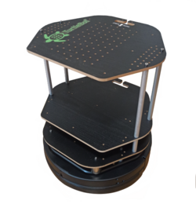

# TurtleBot 4 Simulation and Development Suite

 

A development suite for experimenting with a TurtleBot 4 and ros2 in the Autonomous Systems Design Lab at the [University of Applied Sciences, Esslingen, Germany](https://www.hs-esslingen.de).

This repository is based on the fabulous [Cobot project](https://github.com/robgineer/cobot/tree/main) of [Robert Harbach](https://github.com/robgineer).

## How To Get Started

Have a look at the [documentation overview](doc/docs/index.md) or jump straight to the [quickstart guide](doc/docs/quickstart.md).

## License
SPDX-License-Identifier: BSD 3-Clause AND Apache-2.0

