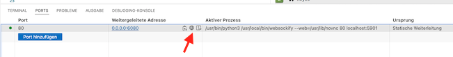
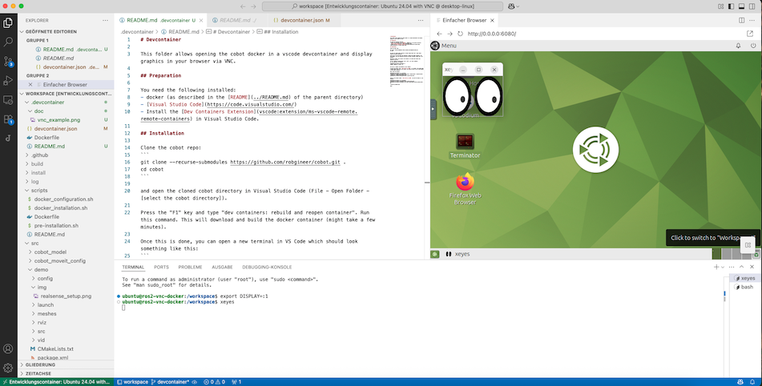
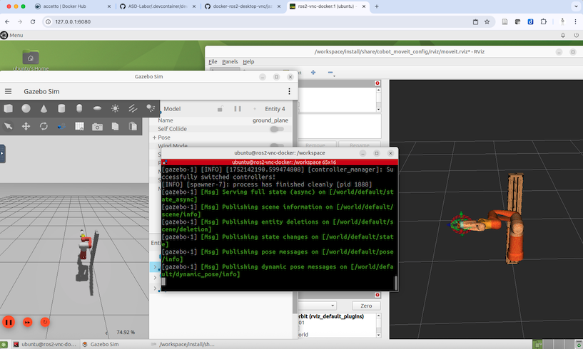

# VNC

This folder allows opening the cobot docker in a vscode devcontainer and display graphics in your browser via VNC.

## Preparation

You need the following installed:

- docker (as described in the [Quickstart guide](quickstart.md))

- [Visual Studio Code](https://code.visualstudio.com/)

- Install the [Dev Containers Extension](vscode:extension/ms-vscode-remote.remote-containers) in Visual Studio Code.

## Install Devcontainer

Clone the cobot repo:
```bash
git clone https://github.com/robgineer/cobot.git .
cd cobot
```

and open the cloned cobot directory in Visual Studio Code (File - Open Folder - [select the cobot directory]).

Press the "F1" key and type "dev containers: rebuild and reopen container". Run this command. This will download and build the docker container (might take a few minutes).

Once this is done, you can open a new terminal in VS Code which should look something like this:
```text
To run a command as administrator (user "root"), use "sudo <command>".
See "man sudo_root" for details.

ubuntu@ros2-vnc-docker:/workspace$ ls
LICENSE  README.md  scripts  src
```

Your user is "ubuntu" and password is also "ubuntu". 

On your host machine, open ``http://127.0.0.1:6080`` in a browser. This should open a noVNC screen, and if you click connect, you should be able to use an XFCE Desktop of your docker container.

You may also open the ubuntu desktop within Visual Studio Code. Just open the "Ports" tab and use the preview icon:



As a test, open a terminal in VS Code and start xeyes on the Ubuntu Desktop:
```bash
ubuntu@ros2-vnc-docker:/workspace$ export DISPLAY=:1
ubuntu@ros2-vnc-docker:/workspace$ xeyes
```



## Build and run the project

Finally, lets build the project:
```bash
ubuntu@ros2-vnc-docker:~$ cd /workspace
ubuntu@ros2-vnc-docker:/workspace$ colcon build --merge-install --symlink-install --cmake-args "-DCMAKE_BUILD_TYPE=Release"
ubuntu@ros2-vnc-docker:/workspace$ source install/setup.bash 
```

Switch to the browser window ``http://127.0.0.1:6080`` and start the demo in a new terminal:
```bash
ubuntu@ros2-vnc-docker:~$ cd /workspace
ubuntu@ros2-vnc-docker:/workspace$ source install/setup.bash
ubuntu@ros2-vnc-docker:/workspace$ ros2 launch cobot_moveit_config gz_demo_launch.py 
```

This should look similar to this:


Done!

## Running on a remote server

You can also run the container on a remote machine via ssh. In order to see the VNC desktop on your local machine, you need to set up an ssh tunnel on your local machine:
```bash
ssh -N -f -L 6081:localhost:6080 <your-user-id>@<remote-machine>
```
Now start vscode on your local machine, connect to your remote server, and open the project in a devcontainer. You can than view the VNC desktop on your local browser at ``http://127.0.0.1:6081``.
