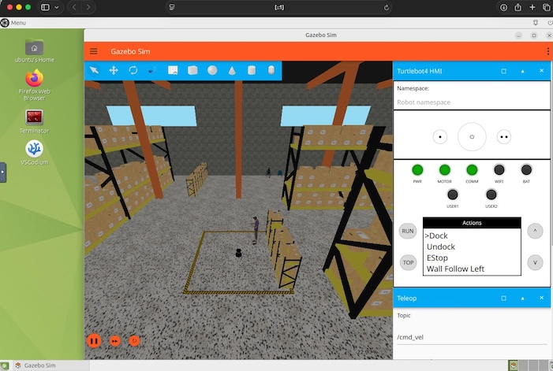

# Simulation


## 1. Build the project

```bash
cd /workspace
source /opt/ros/jazzy/setup.bash
colcon build --merge-install --symlink-install --cmake-args "-DCMAKE_BUILD_TYPE=Release"
source install/setup.bash 
```
(If you are running zsh, replace ``setup.bash`` by ``setup.zsh``)

### Colcon build options explained

`merge-install:` Do not create separate `install` folders for each package bur merge everything into one.

`symlink-install:` Do not copy built files into the install folders but create a symlink. Changes in Python files, for example, take effect immediately (no re-building required).

`cmake-args "-DCMAKE_BUILD_TYPE=Release":` Optimize build for speed


## 2. Run the project

Start the demo in a new terminal:
```bash
cd /workspace
source install/setup.bash
ros2 launch turtlebot4_gz_bringup turtlebot4_gz.launch.py
```

If you are using xpra, a Gazebo window shoule open. For VNC, switch to the browser window ``http://127.0.0.1:6080`` to view the desktop. 

The simulation should look similar to this:


## 3. Use rviz2 for debugging

It is useful to start rviz in a second terminal:
```bash
ros2 launch turtlebot4_viz view_model.launch.py
```

**Done!** Now proceed to the [real TurtleBot](real_turtlebot.md).


